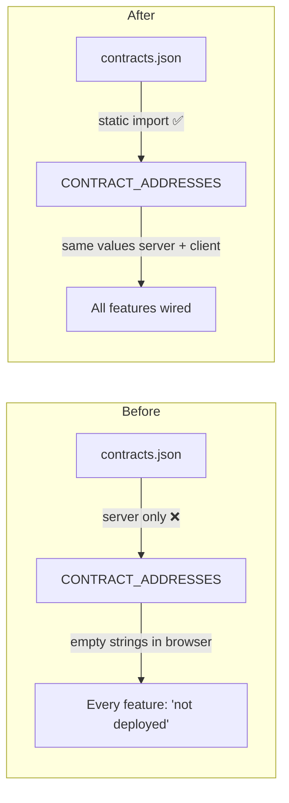
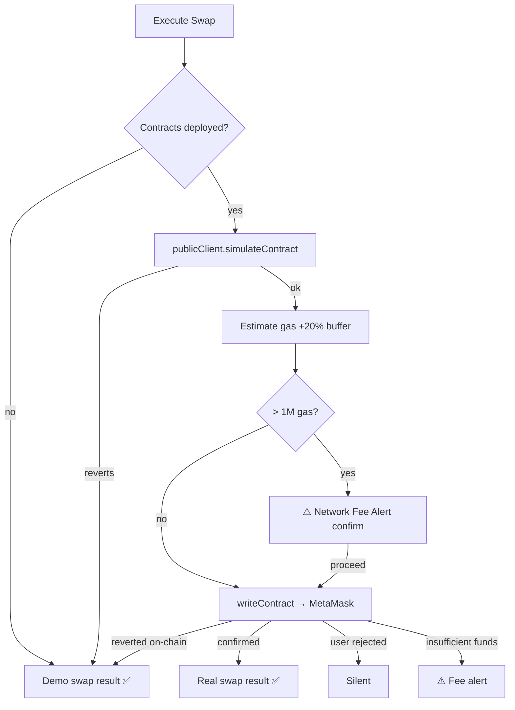
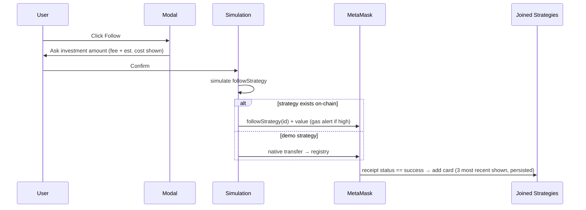
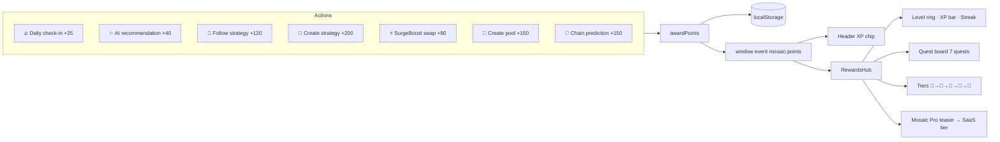
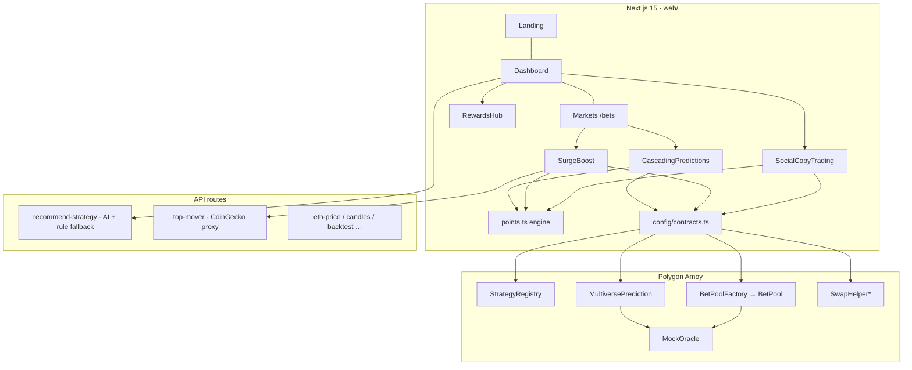
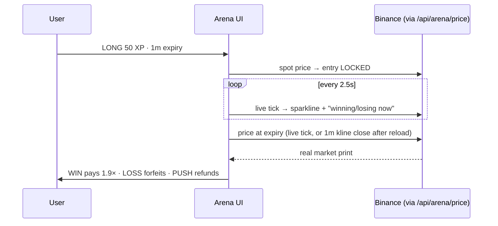

# CHANGES.md — DeFi Mosaic Overhaul

> A complete record of the repair + redesign passes: what was broken, what was fixed,
> what was added, and how the pieces fit together now.

---

## 1. Critical Fixes (the "wiring" pass)

### 1.1 Contract addresses never reached the browser 🔴 (root cause of almost everything)

**File:** `web/src/config/contracts.ts`

The config only loaded `contracts.json` when `typeof window === "undefined"` (server-side).
In the browser every address fell back to `""`, so the whole app believed no contract was
deployed — follows failed, swaps failed, pools never listed.

**Fix:** static `import fileAddrs from "./contracts.json"` (bundled for both server and
client) plus a stricter `isContractDeployed` (regex-validates a real 40-hex address and
rejects the zero address).

### 1.2 SurgeBoost: "Contract interaction Failed" + "Network error"

**Files:** `web/src/components/SurgeBoost.tsx`, `contracts/contracts/SwapHelper.sol`

`SwapHelper.sol` hardcodes the **Polygon mainnet** Uniswap V3 router
(`0xE592…1564`) and WMATIC (`0x0d50…1270`). Neither exists on Amoy testnet, so every
real swap is guaranteed to revert. The old frontend sent the doomed transaction anyway,
then tried to mop up the failure with **five overlapping error handlers plus global
`window` `error`/`unhandledrejection` listeners** — the source of the flaky
"Network error" popups.

**Fix — simulation-first flow:**

No doomed transactions, no global error listeners, no error popups for expected
testnet incompatibilities.

### 1.3 Social Copy Trading rewrite

**File:** `web/src/components/SocialCopyTrading.tsx`

| Problem | Fix |
|---|---|
| One shared `useWriteContract` hook multiplexed create + follow + unfollow; success handlers needed fragile guards | Separate hook instances per flow, each with its own receipt |
| Following demo strategies (ids 1–2) reverted — they don't exist on-chain | Simulation-first: if `followStrategy` would revert, fall back to a **real native transfer** to the registry (its `receive()` is payable) so MetaMask still confirms a genuine transaction |
| Receipt treated "mined" as "succeeded" | Now checks `receipt.status === 'success'` (a mined-but-reverted tx no longer counts as a win) |
| Joined strategies vanished on refresh | Persisted in localStorage (`joinedStrategies`) |
| Leaderboard 24h freeze reset on every reload (in-memory timestamp) | Frozen timestamp persisted (`leaderboardFrozenAt`) |

**Follow flow now:**

### 1.4 Dashboard requirements delivered

- **Available Strategies:** exactly 2 pre-existing cards — *Conservative Yield* then
  *Aggressive Growth* — each with Strategy Fee, Estimated Cost, **Follow** and
  **Manage** buttons.
- **Leaderboard:** exactly 4 fixed entries (the 2 pre-existing + Momentum Master +
  Stable Arbitrage), each showing fee + estimated cost, strictly frozen for 24 h,
  after which it rebuilds from Available Strategies ranked by today's gains.
- **+ Create Strategy:** asks for a **Unique ID** *and* a **Name** (live uniqueness
  validation), goes through MetaMask (`createStrategy` with gas estimation + fee
  alert), then the card appears in Available Strategies with an `ID:` badge and
  persists. The Manage page resolves created strategies' real details from
  localStorage.

### 1.5 AI recommendation API no longer 500s

**File:** `web/src/app/api/recommend-strategy/route.ts`

Without `OPENAI_API_KEY` the route crashed. It now falls back to a **rule-based
allocator** (per risk profile, always includes a low-risk anchor). Also removed a
broken `node-fetch` import and fixed the `tool_call` → `tool_calls` typo.

---

## 2. New Feature: Mosaic Points 🏆 (SaaS foundation)

A client-side gamified rewards engine — the points meta that drives retention across
today's biggest DeFi protocols, and the on-ramp to paid tiers.

**Files:** `web/src/lib/points.ts` (engine), `web/src/components/RewardsHub.tsx` (UI)

- **Levels:** each level needs `250 × level` XP.
- **Tiers:** Bronze (L1) → Silver (L3) → Gold (L6) → Platinum (L10) → Diamond (L15).
- **Streaks:** consecutive-day check-ins; broken streaks reset to 1.
- **Live updates:** any component can subscribe via `onPointsChange` — the header
  XP chip and the hub update the instant XP is earned anywhere in the app.
- **Pro teaser:** 2× XP, deep analytics, unlimited AI — the future paid tier.

XP hooks were wired into every confirmed flow: strategy create/follow
(`SocialCopyTrading`), swaps (`SurgeBoost`), pool creation (`bets/page`),
prediction chains (`CascadingPredictions`), AI recommendations (`dashboard/page`).

---

## 3. Frontend Redesign 🎨

Full design-system pass — dark-first, aurora-glass aesthetic.

### Design system (`globals.css`)
- **Aurora background:** three drifting blurred gradient blobs + subtle grid overlay,
  fixed behind all pages.
- **Typography:** Space Grotesk (display) + Inter (body) via `next/font`.
- **Tokens:** brand accents (violet/blue/cyan/pink/emerald/amber), glass surfaces,
  glow shadows.
- **Utilities:** `.glass-card`, `.glass-panel`, `.text-gradient(-animated)`,
  `.btn-primary` (sheen sweep on hover), `.btn-ghost`, `.section-chip`, `.xp-bar`,
  `.live-dot`, ticker marquee, float/pulse-glow/shimmer keyframes.
- **Accessibility:** `prefers-reduced-motion` disables all decorative animation;
  custom scrollbar + selection colors.

### Pages
- **Landing (`/`):** rebuilt — live-dot "Live on Polygon Amoy" chip, 8xl animated
  gradient hero, floating mosaic tiles, **live market ticker** (CoinGecko top-10 with
  graceful fallback), stat band, 6-tile feature mosaic with hover lift, gradient
  timeline ("Zero to Degen"), Mosaic Points promo with floating tier medals, proper
  footer with faucet link.
- **Header:** sticky glass nav, animated 4-tile mosaic logo (rotates on hover),
  active-route pills, **live XP chip** with tier emoji.
- **Dashboard:** "Command Center" hero, sectioned glass panels with icon chips —
  Rewards → AI Portfolio Optimizer → Social Copy Trading → Strategy Lab (templates,
  backtester, analytics). Empty states got illustrations instead of bare text.
- **Metadata:** was literally `"Create Next App"` — now proper title/description/keywords.
- **Emoji cleanup:** decorative emojis in headings replaced with gradient icon chips
  (e.g. SurgeBoost); emojis retained where they carry meaning (tier medals, quest
  icons, alerts).

---

## 4. Architecture (current state)

\* `SwapHelper` targets mainnet Uniswap addresses — unusable on Amoy; the frontend's
simulation-first flow routes around it (see §1.2).

## 5. Known Constraints

- Demo strategies (ids 1–2) are not on-chain; follows use the native-transfer fallback.
- `MIN_COLLATERAL_RATIO = 150` in `MultiversePrediction.sol` compares against a
  basis-points value (10000-scale) so the check is always permissive — cosmetic,
  requires redeploy to change.
- Points are client-side (localStorage). Moving them server-side (Supabase is already
  a dependency) is the next SaaS step.
- `next.config.ts` ignores TS/ESLint errors at build time; changed files are
  typechecked manually (`npx tsc --noEmit`).

---

## 6. The Real-Engine Pass (Arena, Time Machine, Duels)

### 6.1 SurgeBoost removed ⚫
Verified honestly: `SwapHelper.sol` targets the **mainnet** Uniswap V3 router, which
does not exist on Amoy — a real swap is impossible, so the feature was removed
rather than shipping a demo result. Its replacement is real.

### 6.2 The Arena ⚔️ (`/arena`) — real-market betting, virtual bankroll

- New users get a **500 XP starter bankroll** (one-time, auto-granted).
- Entry locked at the live Binance price; settlement against the real market print.
- Verified live in the browser: a real bet ($64,016 → $64,049.99) settled WON,
  paid 95 XP on a 50 XP stake, balance 450 → 545.
- Busted bankrolls can reload 500 XP; wins/bets award lifetime Mosaic Points.

### 6.3 The Time Machine ⏪ (`/arena/replay`) — bar replay on real history

TradingView sells bar-replay as a paid feature; Mosaic gives it away and gamifies it.
Pick any day from the last year (or roll a random one) and the engine streams the
**genuine 1-minute Binance candles** at 15×/30×/60×. Trade it with 1–10× leverage
from the same XP bankroll: linear P&L, liquidation at −100% of stake, session
summary at the end. Four market hours in four minutes — zero generated data.

### 6.4 Duel Receipts 🧾 — brag links that cannot be faked

Every settled Arena bet has a **share** button producing a URL that encodes the bet.
When anyone opens it, *their own browser* re-fetches the actual Binance kline for
the expiry minute and independently verifies the claimed outcome — displayed as
"✓ VERIFIED on real market data". Trustless social proof + a viral on-ramp
(the visitor is offered their own 500 XP).

### 6.5 Mock purge & backend bug fixes

| Fix | Detail |
|---|---|
| PriceWatcher | Was `1800 + Math.random()*200` fake ETH price → now real via `/api/eth-price` |
| StrategyAnalytics | Random fake trades → deterministic EMA(12)/SMA(20) crossover backtest on real candles |
| CascadingPredictions | Removed the fabricate-success-on-failure branch; errors now surface honestly |
| Micropayments stub | Dead "Sent (stub)" form removed from the Markets page |
| `/api/export/report` | Duplicate `metrics` key in the response object |
| WalletProvider | Invalid `walletConnectProjectId` prop passed to RainbowKit `appInfo` |
| Dead files | Removed `api/ai-chat.ts`, `api/recommend-strategy.js`, `api/micropayments/.../wagmi_wallet.jsx`, `StrategyChatSend.tsx` (wagmi v1 API) |
| `/api/candles` | Now accepts `startTime` for historical windows (powers the Time Machine) |

### 6.6 Cinematic frontend (GSAP)

- **Fonts:** Unbounded (hero display — the web3-native face) + Space Grotesk + Inter.
- **Landing:** GSAP char-by-char hero reveal ("OWN THE NEXT MOVE."), scroll-scrubbed
  parallax exit, CSS-3D rotating mosaic cube driven by scroll, mouse-parallax floating
  tiles, giant scroll-scrubbed outline word band (PREDICT · CHAIN · PROSPER · REPEAT),
  batch-revealed 3D-tilt feature cards, an Arena scene with the live BTC price, and
  reworded degen-native copy throughout. `prefers-reduced-motion` skips it all.
- **Wording pass:** Dashboard → "The Terminal", Markets header → "Live Markets · oracle-settled
  pools · real POL · real outcomes", punchier section copy everywhere.
- Full inventory of remaining mocks/fallbacks: see [mocks_rn.md](./mocks_rn.md).

---

## 6. Round 3 — Arena V2, real engines everywhere, design supremacy

### Arena V2 (binary-options dapp, for real)
- **450+ live markets** from Binance exchangeInfo (`/api/arena/symbols`): all USDT spot pairs — crypto majors/alts, EUR & GBP forex pairs, PAXG gold — with a search box and class badges.
- **5s / 15s / 30s / 1m / 3m / 5m expiries**; short expiries settle against genuine Binance **1-second kline closes** (`/api/arena/price?ts=` picks 1s klines under 20 min age, 1m beyond).
- Charts **seed instantly with the real last hour** of 1m closes, then append live ticks.
- **Paper · XP / Real · POL mode toggle** — real mode routes to the audited on-chain oracle pools.
- Verified end-to-end in the browser: 5s LONG at $63,557.22 → settled $63,574 → +45 XP at 1.9×, bankroll 500→545, record 1-0.

### The House — be the liquidity (new market feature #1)
- The book takes the opposite side of every duel: keeps losing stakes, pays winning profits.
- Users stake XP alongside the protocol's 10,000 XP base book and earn a **pro-rata share of real duel outcomes** (`stakeHouse`/`withdrawHouse` in `arena.ts`); LP risk cuts both ways.

### Market Pulse — whole-market heatmap (new market feature #2)
- `/api/market/pulse` + `MarketPulse.tsx`: live 24h heat across ~600 Binance USDT pairs, market-breadth bar (green vs red), top-96 volume tiles — every tile deep-links into the Arena (`/arena?s=SYMBOL`).

### The Pit — live chat on a real engine
- `/api/arena/chat`: Supabase table `arena_chat` when present (migration SQL appended to `web/supabase_migration.sql`), server-memory ring buffer fallback (still multi-user per deployment). 4s polling, optimistic sends, wallet-address or degen-handle identity, engine tier surfaced in the UI.

### Strategy Analytics V2 + real strategy NAV
- Added **RSI(14)** (Wilder), **MACD(12,26,9) histogram**, **profit factor**, **worst losing streak**, and an **equity curve** of the EMA/SMA crossover engine — all computed from real candles.
- Joined strategies now mark to the **live BTC benchmark × per-strategy beta** — portfolio P&L moves with the actual market instead of sitting frozen.

### Landing page — design supremacy pass
- **Completed tagline**: "OWN THE NEXT ⟨MOVE. / PUMP. / DIP. / CANDLE. / MARKET.⟩" with GSAP word rotation.
- **Market Totem** replaces the cube: pulsing portfolio core, two counter-orbiting rings carrying ₿ Ξ ◎ ⬡ ⚔ satellites, animated 3D candlestick bars — the whole market orbiting your portfolio.
- **The Arsenal**: pinned horizontal-scroll showcase (GSAP scrub) of the five weapons.
- **Brutalist manifesto band** ("REAL PRICES ONLY · RECEIPTS YOU CAN'T FAKE …"), Unbounded hero font, custom neon **cursor** (dot + lagging ring, grows on interactives, site-wide, disabled for touch/reduced-motion).

### Backend bug sweep
- Fixed duplicate `metrics` key in `/api/export/report`; removed dead files (`api/ai-chat.ts`, `api/recommend-strategy.js`, `wagmi_wallet.jsx`, wagmi-v1 `StrategyChatSend.tsx`); fixed invalid RainbowKit `appInfo` prop; removed the dead micropayments stub form; **removed CascadingPredictions' fabricated-success mock** (failures now surface honestly); replaced StrategyAnalytics' random trades with the real crossover engine; extended `/api/candles` with `startTime` for historical windows.
