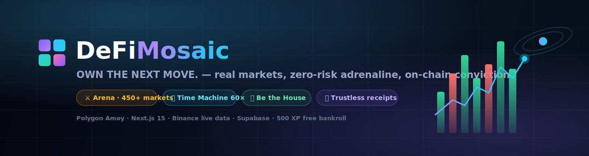
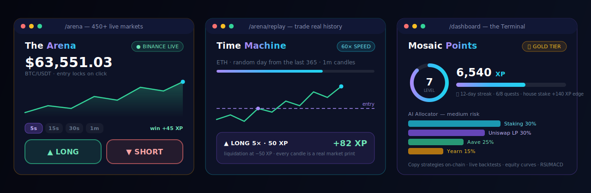
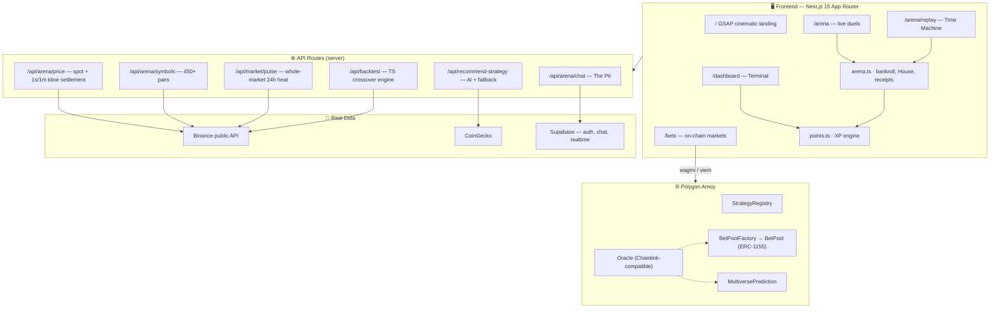
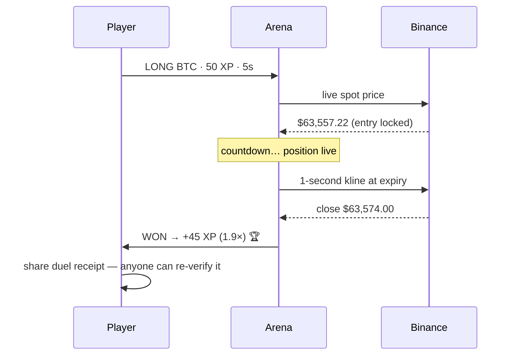
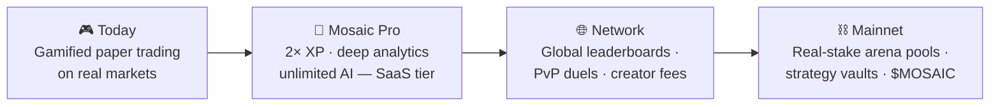

<div align="center">



# DeFi Mosaic

**OWN THE NEXT MOVE.** — real markets, zero-risk adrenaline, on-chain conviction.

[](https://defi-mosaic-kharsh-projects.vercel.app)
[](https://defimosaic.onrender.com)
[](https://d2oynp5hsg4w3r.cloudfront.net)
[](https://amoy.polygonscan.com/)
[](https://nextjs.org)
[](LICENSE)

*Cascading prediction markets · social copy trading · a live-market Arena · AI portfolios — one protocol, every edge.*

</div>

---

## 👀 The Product, at a Glance



**DeFi Mosaic** is a gamified trading universe where newcomers feel a *real* market
with zero risk, and degens graduate to real on-chain positions — all in one place.
Every price is a genuine market print. Nothing is simulated except the currency
you practice with.

| | Tile | What it does |
|---|---|---|
| ⚔️ | **The Arena** | Bet a free **500 XP** bankroll on live Binance prices across **450+ markets** (crypto, FX pairs, gold). 5-second to 5-minute expiries, settled against the actual candle, wins pay **1.9×**. |
| ⏪ | **Time Machine** | Bar-replay any real day from the last year at up to **60×**, traded with 1–10× leverage. TradingView sells this feature — Mosaic gamifies it free. |
| 🏦 | **The House** | Stake XP into the book that underwrites every duel and earn a pro-rata share of the edge. LP economics you can *feel*. |
| 🧾 | **Duel Receipts** | Share any settled bet as a link the viewer's own browser **re-verifies against public Binance data**. Brag links that cannot be faked. |
| 🔥 | **Market Pulse** | A live heatmap of the entire Binance USDT universe (~600 pairs) — breadth, heat, volume leaders. Every tile is a door into the Arena. |
| 🔗 | **Cascading Predictions** | Post collateral, take an undercollateralized loan (up to 80% leverage), chain child predictions. Green chains amplify; failed parents liquidate the subtree. |
| 👥 | **Social Copy Trading** | Follow strategies with transparent 0–20% fees or publish your own. Strategy pages run **live backtests** (real candles, real fees, buy-&-hold benchmark). |
| 🧠 | **AI Allocator** | Risk-profiled portfolios across lending, staking and LPs with live APYs — rule-based fallback keeps it working without any API key. |
| 🏆 | **Mosaic Points** | XP on every action: levels, streaks, quests, tiers 🥉→💎. The SaaS on-ramp (Pro multipliers next). |

---

## 🧭 Why It Wins

**For newcomers** — the single scariest thing about trading is losing money while
learning. Mosaic gives the full adrenaline loop — live prices, ticking expiries,
liquidations, win streaks — on a paper bankroll, then walks users on-chain via a
built-in guide and faucet POL. Zero-to-degen in five guided steps.

**For traders** — a 5-second binary duel engine on 450+ real markets, historical
bar-replay training, honest backtesting with buy-&-hold verdicts, and copy trading
with receipts. The tools professionals pay for, gamified.

**For the protocol** — every mechanic feeds the XP economy: bets, wins, streaks,
house staking, referral-grade duel receipts. Retention is native, not bolted on.
Pro tier (2× XP, deep analytics, unlimited AI) is the natural monetization.

---

## 🏗️ Architecture



### How a 5-second duel settles (all real)



---

## 🚀 Quick Start

```bash
git clone https://github.com/harsh11067/DefiMosaic.git
cd DefiMosaic/web
npm install
npm run dev          # → http://localhost:3000
```

That's it — the Arena, Time Machine, Market Pulse, backtester and AI allocator
run on public market data with **zero configuration**. Optional env
(`web/.env.local`) unlocks more:

```env
NEXT_PUBLIC_SUPABASE_URL=...        # durable chat + Google sign-in
NEXT_PUBLIC_SUPABASE_ANON_KEY=...
SUPABASE_SERVICE_ROLE_KEY=...
OPENAI_API_KEY=...                  # AI recommendations (rule-based fallback without)
NEXT_PUBLIC_WC_PROJECT_ID=...       # WalletConnect
```

For on-chain features: MetaMask on **Polygon Amoy** + free test POL from the
[faucet](https://faucet.polygon.technology/). Contracts redeploy with
`cd contracts && npx hardhat run scripts/deploy.ts --network polygon_amoy`
(addresses auto-write to `web/src/config/contracts.json`).

Supabase schema: run [`web/supabase_migration.sql`](web/supabase_migration.sql)
once in the SQL editor (chat + messages tables, RLS included).

---

## 📜 Contracts (Polygon Amoy)

| Contract | Address |
|----------|---------|
| StrategyRegistry | [`0x205A…934e`](https://amoy.polygonscan.com/address/0x205Ac2D3781799Ff979c3E927228eeCD5e88934e) |
| BetPoolFactory | [`0xccbF…0DCA`](https://amoy.polygonscan.com/address/0xccbFfd7B0E9F7d2bEA601E3a8d5Cdfb309460DCA) |
| MultiversePrediction | [`0xeCAC…3d41`](https://amoy.polygonscan.com/address/0xeCAC342F6088be9a228BFeDf76fd1761F3233d41) |
| Bet1155 | [`0xF611…5958`](https://amoy.polygonscan.com/address/0xF6115e1Be9c9B071D30BbF0559a4236Acdc65958) |
| USDCMock / MockOracle | testnet stand-ins (see [`contracts.json`](web/src/config/contracts.json)) |

---

## 📈 Product Potential



- **Acquisition:** free 500 XP + shareable, trustlessly-verifiable duel receipts = viral loops with proof built in.
- **Retention:** streaks, quests, tiers, house staking — the points meta that top protocols run, native from day one.
- **Monetization:** Pro subscriptions, strategy marketplace fees, house-pool spread.
- **Moat:** honest engines. Every number traces to a public market print — competitors demo with fakes; Mosaic verifies in your browser.

---

## 🧪 Honesty Layer

Every mock, fallback and stub in the codebase is publicly inventoried in
[**mocks_rn.md**](mocks_rn.md) — what's real (🟢), what degrades gracefully (🟡),
and what was deleted rather than faked (⚫). The full overhaul history lives in
[CHANGES.md](CHANGES.md).

## 🌐 Live Deployments

| Target | URL |
|---|---|
| ▲ Vercel (primary) | https://defi-mosaic-kharsh-projects.vercel.app |
| Render (backend) | https://defimosaic.onrender.com *(free tier — first hit wakes it, ~30s)* |
| AWS CloudFront → EC2 | https://d2oynp5hsg4w3r.cloudfront.net |

Full infra details: [DEPLOYMENTS.md](DEPLOYMENTS.md)

## 🛠️ Tech

Next.js 15 · React 19 · TypeScript · Tailwind 4 · GSAP + Framer Motion ·
wagmi/viem + RainbowKit · Supabase · Solidity 0.8 + Hardhat + OpenZeppelin ·
Binance/CoinGecko public data

## 📄 License

MIT — build on it.

<div align="center">

**Built with conviction. Settled by the market.** ⚔️

</div>
