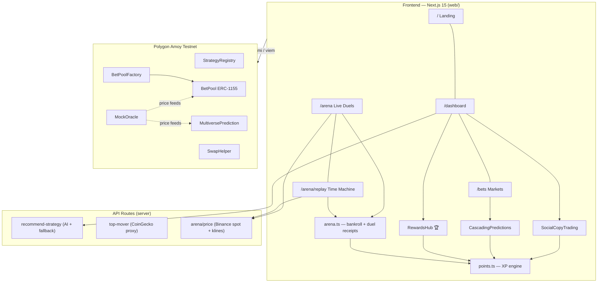
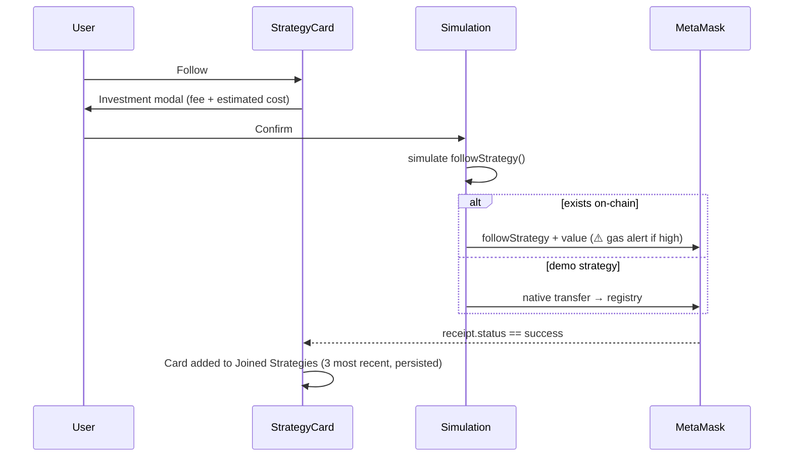

# DeFi Mosaic

> **Predict. Chain. Prosper.** — Cascading prediction markets, social copy trading,
> AI-guided portfolios and gamified rewards, unified on Polygon.


---

## What is DeFi Mosaic?

Most DeFi platforms give you one primitive. Mosaic composes **eight** into a single edge:

| Tile | What it does |
|---|---|
| 🔗 **Cascading Predictions** | Post collateral, take an undercollateralized loan (up to 80% leverage) and chain child predictions from it. Parent wins amplify the whole tree; parent failures liquidate the subtree. |
| 👥 **Social Copy Trading** | Follow top strategies with transparent 0–20% fees, or publish your own with a unique ID and monetize your edge. |
| 🧠 **AI Portfolio Optimizer** | Risk-profiled allocations across lending, staking and LP strategies with live APY awareness — works with or without an OpenAI key (rule-based fallback built in). |
| 🎯 **Prediction Pools** | Oracle-resolved price pools (native POL or ERC-20). Take a side, claim 2× on wins. |
| ⚔️ **The Arena** | Bet a 500 XP starter bankroll on live Binance prices — entry locked on click, settled against the real market print at expiry, wins pay 1.9×. Real market, zero risk. |
| ⏪ **Time Machine** | Bar-replay trading on real history: any day from the last year streamed at 15–60×, traded with 1–10× leverage. (TradingView sells this — Mosaic gamifies it free.) |
| 🧾 **Duel Receipts** | Share any settled Arena bet as a link the viewer's browser re-verifies against public Binance data — brag links that cannot be faked. |
| 🏆 **Mosaic Points** | Every action earns XP: levels, daily streaks, quests and tier badges (🥉→💎). The foundation for Pro-tier SaaS features. |

---

## Architecture



**Address wiring:** the deploy script writes `web/src/config/contracts.json`; the
frontend statically imports it via `web/src/config/contracts.ts` so addresses are
identical on server and client. `NEXT_PUBLIC_*` env vars override per-key.

---

## Key Flows

### Follow a strategy



### Cascading prediction chain

```
Root (1 POL collateral, 80% leverage → 0.8 POL loan)
 └── Child B (funded by the 0.8 POL loan)
      └── Child C (funded by B's loan)
Root succeeds → chain amplifies ROI · Root fails → subtree liquidates
```

### Mosaic Points

Every confirmed action awards XP through a single engine (`web/src/lib/points.ts`):
daily check-in +25 🔥 · AI recommendation +40 ✨ · Arena bet +30 ⚔️ · Arena win +60 🏆 ·
follow +120 🤝 · create strategy +200 🧠 · pool +150 🎯 · chained prediction +150 🔗.
Levels need `250 × level` XP; tiers unlock at levels 1/3/6/10/15. State persists in
localStorage and broadcasts via a `mosaic:points` window event so the header XP chip
and RewardsHub update live.

---

## Quick Start

**Prerequisites:** Node 18+, MetaMask, Polygon Amoy configured, test POL from the
[Polygon Faucet](https://faucet.polygon.technology/).

```bash
# 1. Install
cd contracts && npm install
cd ../web && npm install

# 2. (Optional) redeploy contracts — updates web/src/config/contracts.json
cd ../contracts
npx hardhat run scripts/deploy.ts --network polygon_amoy

# 3. Run
cd ../web
npm run dev        # → http://localhost:3000
```

**Environment (`web/.env.local`, all optional):**

```env
NEXT_PUBLIC_DEFAULT_NETWORK=polygon_amoy
NEXT_PUBLIC_WC_PROJECT_ID=your_walletconnect_id
NEXT_PUBLIC_ALCHEMY_API_URL=https://...      # custom Amoy RPC
OPENAI_API_KEY=sk-...                        # AI recs; rule-based fallback without it
```

---

## Contract Addresses (Polygon Amoy)

Source of truth: [`web/src/config/contracts.json`](web/src/config/contracts.json)

| Contract | Address |
|----------|---------|
| StrategyRegistry | `0x205Ac2D3781799Ff979c3E927228eeCD5e88934e` |
| BetPoolFactory | `0xccbFfd7B0E9F7d2bEA601E3a8d5Cdfb309460DCA` |
| MultiversePrediction | `0xeCAC342F6088be9a228BFeDf76fd1761F3233d41` |
| Bet1155 | `0xF6115e1Be9c9B071D30BbF0559a4236Acdc65958` |
| SwapHelper | `0x12c5e8566A75D2b2c3930f8296b1260F35663030` |
| USDCMock | `0xdF1039b709ec6F46C1068Db0aFbF3C11fE680390` |
| MockOracle | `0x1A7C52aC137Fd4f9909FB107057f8eb770F87CF6` |

---

## Project Structure

```
DefiMosaic/
├── contracts/                # Hardhat + Solidity ^0.8.24
│   ├── contracts/            # BetPool(Factory), MultiversePrediction,
│   │                         # StrategyRegistry, SwapHelper, mocks
│   ├── scripts/deploy.ts     # deploys + writes web contracts.json
│   └── test/
├── web/                      # Next.js 15 App Router
│   └── src/
│       ├── app/              # /, /dashboard, /bets, /api/*
│       ├── components/       # RewardsHub, SocialCopyTrading,
│       │                     # CascadingPredictions, StrategyCard, …
│       ├── config/           # contracts.ts + contracts.json
│       └── lib/              # points.ts (XP engine) · arena.ts (Arena,
│                             #   Time Machine bankroll, duel receipts)
├── CHANGES.md                # full changelog of the overhaul (with diagrams)
└── PROJECT_DOCUMENTATION.md  # deep technical reference
```

---

## Testnet Notes (important)

- **SwapHelper** references the **mainnet** Uniswap V3 router, which doesn't exist on
  Amoy — real swaps would always revert, so the SurgeBoost UI was removed until a
  real router deployment exists. Full mock/fallback inventory: [mocks_rn.md](./mocks_rn.md).
- The two pre-seeded strategies (*Conservative Yield*, *Aggressive Growth*) are
  demo entries, not on-chain registry rows; following them sends a real native
  transfer to the registry instead of `followStrategy`.
- Created strategies, joined strategies, the leaderboard freeze window and Mosaic
  Points persist in localStorage.

## Testing & Docs

```bash
cd contracts && npm test                       # contract tests
cd web && npx tsc --noEmit                     # typecheck (build ignores TS errors)
```

- [CHANGES.md](./CHANGES.md) — what was fixed/added and why, with flow diagrams
- [PROJECT_DOCUMENTATION.md](./PROJECT_DOCUMENTATION.md) — full technical reference
- [SETUP.md](./SETUP.md) — extended setup guide

## Roadmap

- [x] Cascading predictions · social copy trading · AI optimizer · live prices
- [x] Mosaic Points (XP, levels, streaks, quests, tiers)
- [x] The Arena — real-market XP betting (500 XP starter bankroll)
- [x] Time Machine — bar-replay trading on real Binance history
- [x] Duel Receipts — trustlessly verifiable share links
- [ ] **Mosaic Pro** — 2× XP, deep analytics, unlimited AI (SaaS tier)
- [ ] Server-side points + global leaderboard (Supabase)
- [ ] Real DEX integration on mainnet · multi-chain support
- [ ] Governance token + strategy marketplace

## License

MIT — see [LICENSE](LICENSE).

---

**Built with ❤️ for the DeFi community** · *DeFi Mosaic — where predictions meet prosperity.*
